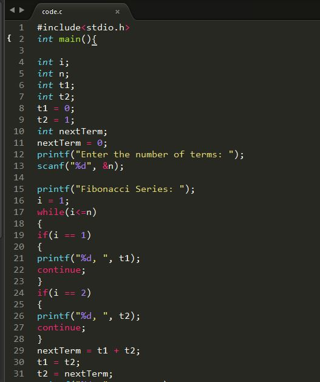
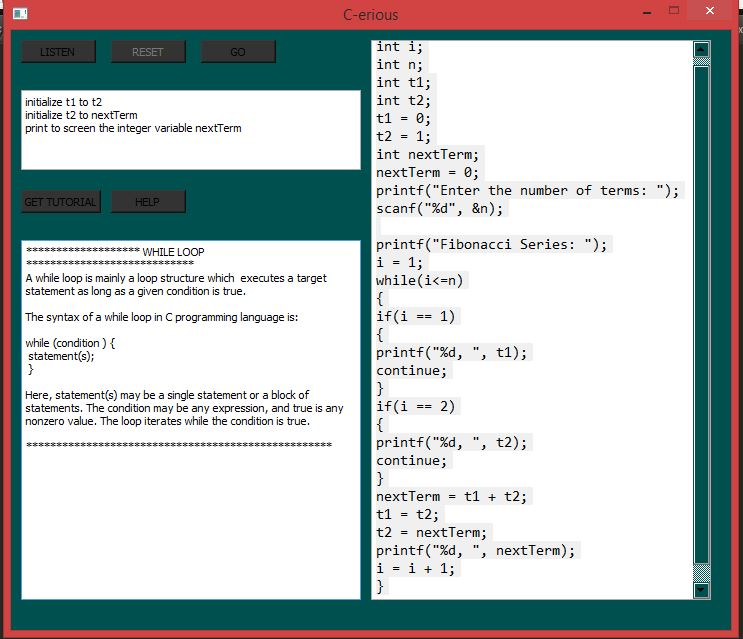

# SE-Project
 Coding by speaking in English
Cerious is a desktop application that converts spoken/written english sentences to lines of code in C.

Example: The input in the textbox of the top left corner will generate the code in the right textbox.

Also, a file named code.c will also be generated that can be compiled and executed.

